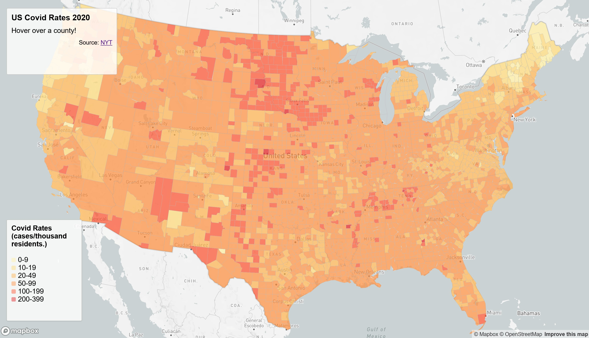
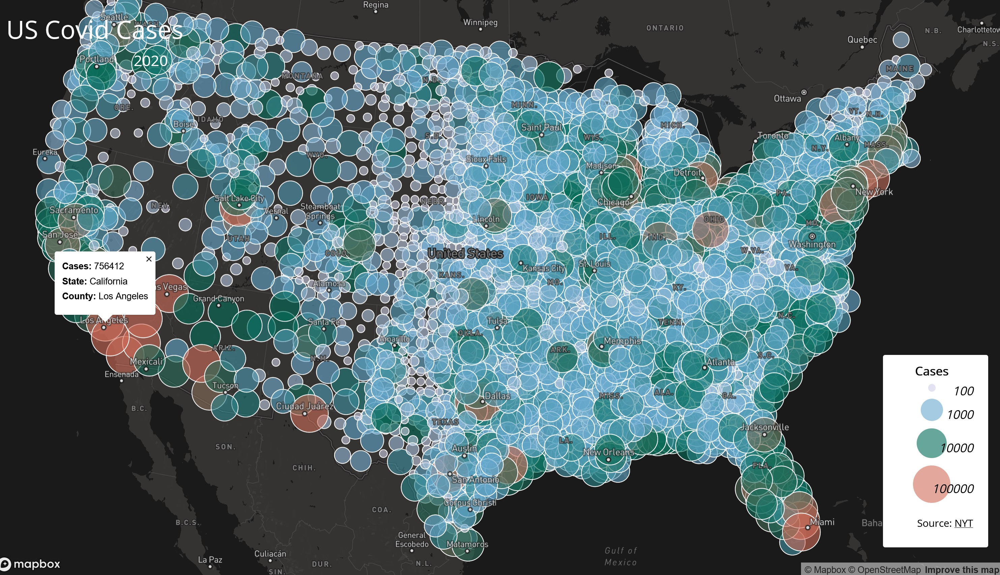

# Geog 458 Lab 3: Mapping US Covid Data 2020

This file will have a brief introduction, links to the map, screenshots, the primary functions, data sources, credit, acknowledgment, and other necessary information. 

### Introduction
The Covid-19 virus began to majorly spread in 2020. The US was also greatly affected. This project maps Covid case counts and rates in the mainland US.

### Links to the interactive maps

[Covid rates in the Mainland US by county, 2020](https://aaron-thai.github.io/uscovid2020/map1.html)
 
Interactive choropleth map of Covid rates in the US by county, in cases per thousand residents. Hover over a county to see the state, county, and rate.

[Covid cases in the Mainland US by county, 2020](https://aaron-thai.github.io/uscovid2020/map2.html)
 
Interactive proportional map of Covid counts in the US by county. Click on a dot to see the state, county, and case count.

### Data sources, resources, tools 
The [New York Times](https://github.com/nytimes/covid-19-data/blob/43d32dde2f87bd4dafbb7d23f5d9e878124018b8/live/us-counties.csv) gathered data to track Covid trends.

Population data used to calculate Covid case rates was from the [2018 ACS 5-year estimates](https://data.census.gov/cedsci/table?g=0100000US%24050000&d=ACS%205-Year%20Estimates%20Data%20Profiles&tid=ACSDP5Y2018.DP05&hidePreview=true).

US county shapefiles are from the [U.S. Census Bureau](https://www.census.gov/geographies/mapping-files/time-series/geo/carto-boundary-file.html).

[Data](https://github.com/jakobzhao/geog458/tree/master/labs/lab03) was processed by Steven Bao.

[Mapbox Javascript API](https://docs.mapbox.com/mapbox-gl-js/api/) was used to make the maps.

Guides used to create the [choropleth](https://github.com/jakobzhao/geog495/tree/main/labs/lab04) and [proportional](https://github.com/jakobzhao/geog458/tree/master/labs/lab03) maps.

[QGIS 3.16.15](https://qgis.org/en/site/) was used to convert shapefile to GEOJSON.

[Mapshaper](https://mapshaper.org/) was used to reduce GEOJSON file size.

[Visual Studio Code](https://code.visualstudio.com/) was used to edit the code.

[Lightshot](https://app.prntscr.com/en/index.html) was used to take the map screenshots.